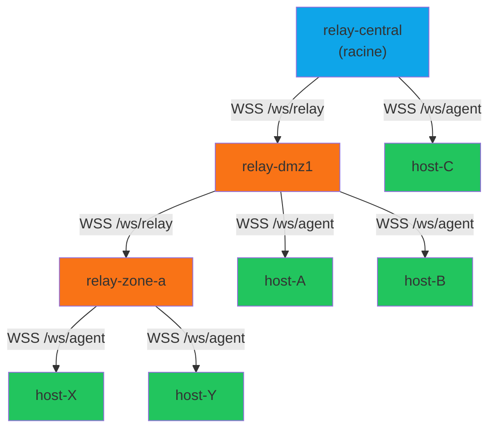
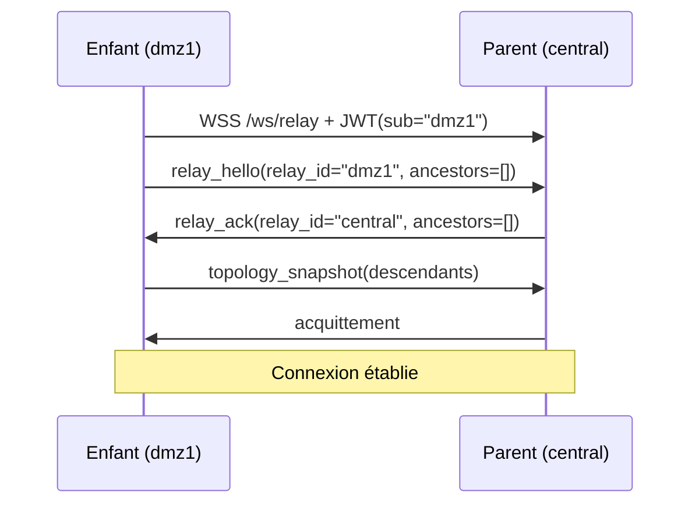
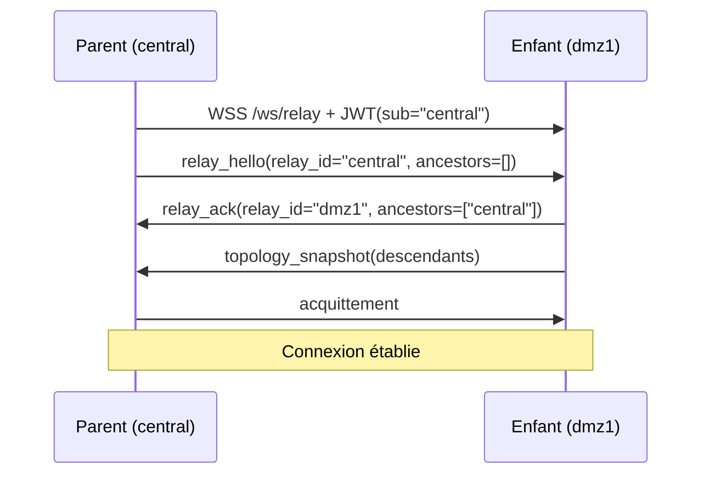
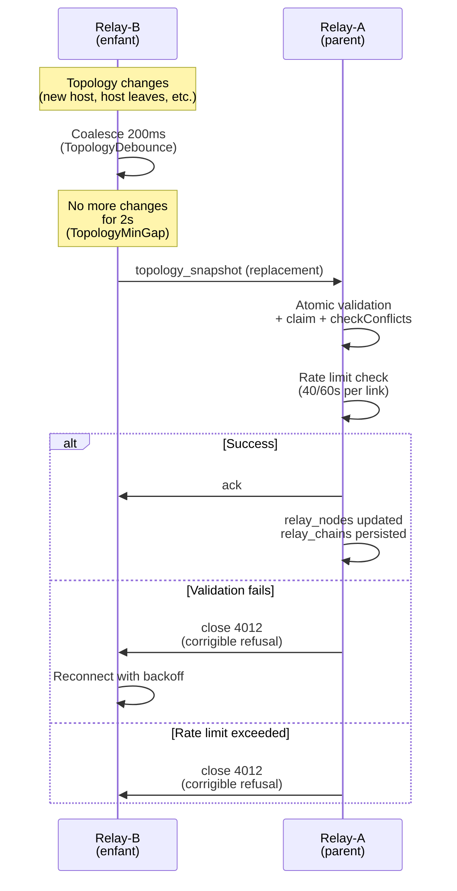

# Ansible-SecAgent — High-Level Design (HLD) v3.0.3

> Vue d'ensemble architecturale du système.
> **v3.0.3** : WebSocket direct dispatch (pas NATS), état fichier, Docker Compose multi-hôtes.
> Pour les spécifications détaillées, voir [ARCHITECTURE.md](ARCHITECTURE.md).

---

## Table des matières

1. [Contexte système](#1-contexte-système)
2. [Décomposition des composants](#2-décomposition-des-composants)
3. [Flux de messages](#3-flux-de-messages)
   - 3.1 [Provisioning et enrollment](#31-provisioning-et-enrollment)
   - 3.2 [Exécution d'un playbook — chemin nominal](#32-exécution-dun-playbook--chemin-nominal)
   - 3.3 [Routage HA entre nodes relay](#33-routage-ha-entre-nodes-relay)
   - 3.4 [Gestion des erreurs](#34-gestion-des-erreurs)
   - 3.5 [Révocation d'un agent](#35-révocation-dun-agent)
4. [Vue déploiement](#4-vue-déploiement)
   - 4.1 [Docker Compose — tests / qualification](#41-docker-compose--tests--qualification)
   - 4.2 [Kubernetes — production](#42-kubernetes--production)
5. [Matrice des interfaces](#5-matrice-des-interfaces)
6. [Décisions architecturales clés](#6-décisions-architecturales-clés)

---

## 1. Contexte système

Ansible-SecAgent permet d'exécuter des playbooks Ansible sur des hôtes distants **sans ouvrir de port entrant**. Les agents initient toutes les connexions vers le serveur central.

```
╔══════════════════════════════════════════════════════════════════════════╗
║                         CONTEXTE SYSTÈME                                 ║
╠══════════════════════════════════════════════════════════════════════════╣
║                                                                          ║
║   ┌──────────────┐     lance des       ┌────────────────────────────┐   ║
║   │   Opérateur  │────playbooks───────▶│    Ansible Control Node    │   ║
║   │   Ansible    │                     │  (inventory + conn plugin)  │   ║
║   └──────────────┘                     └──────────────┬─────────────┘   ║
║                                                        │ HTTPS           ║
║   ┌──────────────┐    autorise les     ┌──────────────▼─────────────┐   ║
║   │  Pipeline    │───nouvelles clefs──▶│                            │   ║
║   │  CI/CD       │    HTTPS admin      │      RELAY SERVER          │   ║
║   │(Terraform    │                     │   (FastAPI + NATS)         │   ║
║   │  /Packer)    │                     │                            │   ║
║   └──────────────┘                     └──────────────▲─────────────┘   ║
║                                                        │ WSS persistant   ║
║                                          ┌─────────────┴──────────────┐  ║
║                                          │      HÔTES GÉRÉS           │  ║
║                                          │   host-A  host-B  host-C   │  ║
║                                          │  (secagent-minion + systemd)   │  ║
║                                          └────────────────────────────┘  ║
║                                                                          ║
║  Flux sortants uniquement depuis les hôtes gérés (NAT/firewall friendly) ║
╚══════════════════════════════════════════════════════════════════════════╝
```

### Acteurs

| Acteur | Rôle |
|---|---|
| Opérateur Ansible | Lance des playbooks depuis le control node |
| Pipeline CI/CD | Provisionne les serveurs et pré-enregistre leurs clefs |
| Ansible Control Node | Hôte exécutant `ansible-playbook`, portant les plugins relay |
| Relay Server | Broker central — reçoit les tâches, les route aux agents |
| Hôtes gérés | Serveurs cibles portant le `secagent-minion` en tant que service systemd |

---

## 2. Décomposition des composants

```
╔═══════════════════════════════════════════════════════════════════════════════════╗
║                         DÉCOMPOSITION DES COMPOSANTS                              ║
╠═══════════════════════════════════════════════════════════════════════════════════╣
║                                                                                   ║
║  ┌─────────────────────────────────────────────────────────────────────────────┐ ║
║  │                        ANSIBLE CONTROL NODE                                  │ ║
║  │                                                                               │ ║
║  │  ┌──────────────────────────┐     ┌──────────────────────────────────────┐  │ ║
║  │  │   INVENTORY PLUGIN       │     │        CONNECTION PLUGIN             │  │ ║
║  │  │   secagent_inventory.py     │     │        secagent.py                      │  │ ║
║  │  │                          │     │                                      │  │ ║
║  │  │  • GET /api/inventory    │     │  • POST /api/exec/{host}   (exec)    │  │ ║
║  │  │  • retourne JSON Ansible │     │  • POST /api/upload/{host} (put)     │  │ ║
║  │  │  • filtre ?only_connected│     │  • POST /api/fetch/{host}  (fetch)   │  │ ║
║  │  └────────────┬─────────────┘     └─────────────────┬────────────────────┘  │ ║
║  └───────────────┼───────────────────────────────────── ┼ ──────────────────────┘ ║
║                  │ HTTPS                                │ HTTPS bloquant           ║
║                  │ GET /api/inventory                   │ POST /api/exec           ║
║  ┌───────────────▼──────────────────────────────────── ▼ ──────────────────────┐ ║
║  │                           RELAY SERVER                                       │ ║
║  │                                                                               │ ║
║  │  ┌────────────────────┐  ┌──────────────────┐  ┌──────────────────────────┐ │ ║
║  │  │    REST API        │  │   WS HANDLER     │  │     AUTH MANAGER         │ ║ ║
║  │  │    (GO native)     │  │                  │  │                          │ ║ ║
║  │  │                    │  │  ws_connections  │  │  • Enroll /api/register  │ ║ ║
║  │  │  /api/register     │  │  {"host": ws}    │  │  • Verify JWT            │ ║ ║
║  │  │  /api/exec/{host}  │  │                  │  │  • Blacklist JTI         │ ║ ║
║  │  │  /api/upload/{host}│  │  • Route tâches  │  │  • Rôles agent/plugin/   │ ║ ║
║  │  │  /api/fetch/{host} │  │    vers agents   │  │    admin                 │ ║ ║
║  │  │  /api/inventory    │  │  • Collecte      │  │  • Révocation            │ ║ ║
║  │  │  /api/admin/auth   │  │    résultats     │  └──────────────────────────┘ ║ ║
║  │  └─────────┬──────────┘  └────────┬─────────┘                               │ ║
║  │            │                      │                                           │ ║
║  │  ┌─────────▼──────────────────────▼───────────────────────────────────────┐ │ ║
║  │  │                          NATS CLIENT                                    │ │ ║
║  │  │                                                                         │ │ ║
║  │  │   publish  →  tasks.{hostname}        subscribe  ←  tasks.{hostname}   │ │ ║
║  │  │   subscribe ← results.{task_id}       publish   →  results.{task_id}   │ │ ║
║  │  └─────────────────────────────┬───────────────────────────────────────────┘ │ ║
║  │                                │                                              │ ║
║  │  ┌─────────────────────────────▼───────────────────────────────────────────┐ │ ║
║  │  │                          DB STORE                                        │ │ ║
║  │  │                                                                          │ │ ║
║  │  │   agents │ authorized_keys │ blacklist    (SQLite MVP / PostgreSQL prod) │ │ ║
║  │  └──────────────────────────────────────────────────────────────────────────┘ │ ║
║  └──────────────────────────────────────────────────────────────────────────────┘ ║
║                               │ WSS persistant                                    ║
║                               │ (1 connexion par agent)                           ║
║  ┌────────────────────────────▼─────────────────────────────────────────────────┐ ║
║  │                           NATS JETSTREAM CLUSTER                              │ ║
║  │                                                                               │ ║
║  │   Stream RELAY_TASKS    subjects: tasks.{hostname}    WorkQueue, TTL 5min    │ ║
║  │   Stream RELAY_RESULTS  subjects: results.{task_id}   Limits,   TTL 60s     │ ║
║  └────────────────────────────┬─────────────────────────────────────────────────┘ ║
║            ╔═══════════════════╩══════════════════╗                               ║
║            ║      routage inter-nodes relay        ║                               ║
║            ╚══════════════════════════════════════╝                               ║
║  ┌─────────────────────────────────────────────────────────────────────────────┐ ║
║  │                           HÔTES GÉRÉS                                        │ ║
║  │                                                                               │ ║
║  │  ┌───────────────────────┐   ┌───────────────────────┐                      │ ║
║  │  │     RELAY AGENT       │   │     RELAY AGENT       │        ...            │ ║
║  │  │     host-A            │   │     host-B            │                      │ ║
║  │  │                       │   │                       │                      │ ║
║  │  │  • WS LISTENER        │   │  • WS LISTENER        │                      │ ║
║  │  │  • TASK RUNNER        │   │  • TASK RUNNER        │                      │ ║
║  │  │    (subprocess pool)  │   │    (subprocess pool)  │                      │ ║
║  │  │  • ASYNC REGISTRY     │   │  • ASYNC REGISTRY     │                      │ ║
║  │  │  • RECONNECT MANAGER  │   │  • RECONNECT MANAGER  │                      │ ║
║  │  └───────────────────────┘   └───────────────────────┘                      │ ║
║  └─────────────────────────────────────────────────────────────────────────────┘ ║
╚═══════════════════════════════════════════════════════════════════════════════════╝
```

---

## 3. Flux de messages

### 3.1 Provisioning et enrollment

```
 PIPELINE CI/CD          RELAY SERVER            RELAY AGENT (host-A)
      │                       │                          │
      │  ① POST /api/admin/authorize                     │
      │  { hostname: "host-A",│                          │
      │    public_key_pem: ...│                          │
      │    approved_by: "tf" }│                          │
      │──────────────────────▶│                          │
      │                       │ INSERT authorized_keys   │
      │  HTTP 201             │                          │
      │◀──────────────────────│                          │
      │                       │                          │
      │  [serveur provisionné, agent démarre via systemd]│
      │                       │                          │
      │                       │  ② POST /api/register    │
      │                       │  { hostname: "host-A",   │
      │                       │    public_key_pem: ... } │
      │                       │◀─────────────────────────│
      │                       │                          │
      │                       │ SELECT authorized_keys   │
      │                       │ WHERE hostname="host-A"  │
      │                       │ → clef correspondante ✓  │
      │                       │                          │
      │                       │ génère JWT               │
      │                       │ chiffre JWT avec pubkey  │
      │                       │ INSERT agents            │
      │                       │                          │
      │                       │  HTTP 200                │
      │                       │  { token_encrypted,      │
      │                       │    server_public_key }   │
      │                       │──────────────────────────▶
      │                       │                          │ déchiffre token
      │                       │                          │ stocke JWT + server.pub
      │                       │                          │
      │                       │  ③ WSS /ws/agent         │
      │                       │  Authorization: Bearer   │
      │                       │◀─────────────────────────│
      │                       │                          │
      │                       │ verify JWT signature     │
      │                       │ check JTI not blacklisted│
      │                       │ ws_connections["host-A"] │
      │                       │  = ws_object             │
      │                       │                          │
      │                       │  WS OPEN ✓               │
      │                       │──────────────────────────▶
      │                       │                          │ connexion persistante
      │                       │                ◀─────────────────────────
      │                       │              heartbeat (ping/pong WS natif)
```

---

### 3.2 Exécution d'un playbook — chemin nominal

```
 CONN PLUGIN          RELAY SERVER (Node #1)      NATS CLUSTER      RELAY AGENT (host-A)
      │                        │                       │                     │
      │  ① POST /api/exec/     │                       │                     │
      │    host-A              │                       │                     │
      │  { task_id: "t-001",   │                       │                     │
      │    cmd: "python3 ...", │                       │                     │
      │    timeout: 30 }       │                       │                     │
      │───────────────────────▶│                       │                     │
      │                        │  ② publish            │                     │
      │                        │  tasks.host-A         │                     │
      │                        │  { task_id: "t-001",  │                     │
      │                        │    cmd: "...",        │                     │
      │                        │    expires_at: +30s } │                     │
      │                        │──────────────────────▶│                     │
      │                        │                       │  ③ deliver          │
      │   [bloquant]           │                       │  tasks.host-A       │
      │                        │                       │────────────────────▶│
      │                        │                       │                     │ NATS ACK
      │                        │                       │◀────────────────────│
      │                        │                       │                     │
      │                        │  ④ WS: ack t-001      │                     │
      │                        │◀──────────────────────────────────────────── │
      │                        │                       │                     │ spawn subprocess
      │                        │                       │                     │ python3 ...
      │                        │  ⑤ WS: stdout         │                     │
      │                        │◀──────────────────────────────────────────── │
      │                        │  (streaming)          │                     │ ...
      │                        │                       │                     │
      │                        │  ⑥ WS: result         │                     │
      │                        │  { task_id: "t-001",  │                     │
      │                        │    rc: 0,             │                     │
      │                        │    stdout: "..." }    │                     │
      │                        │◀──────────────────────────────────────────── │
      │                        │                       │                     │
      │                        │  ⑦ publish            │                     │
      │                        │  results.t-001        │                     │
      │                        │──────────────────────▶│                     │
      │                        │                       │                     │
      │  HTTP 200              │                       │                     │
      │  { rc: 0,              │                       │                     │
      │    stdout: "..." }     │                       │                     │
      │◀───────────────────────│                       │                     │
      │                        │                       │                     │
   [exec_command()             │                       │                     │
    retourne → Ansible         │                       │                     │
    continue]                  │                       │                     │
```

#### Transfert de fichier (put_file) — précède exec_command

```
 CONN PLUGIN          RELAY SERVER              RELAY AGENT (host-A)
      │                    │                           │
      │  POST /api/upload/ │                           │
      │  host-A            │                           │
      │  { task_id,        │                           │
      │    dest: "/tmp/...",│                           │
      │    data: <base64>, │                           │
      │    mode: "0700" }  │                           │
      │───────────────────▶│                           │
      │                    │  WS: put_file             │
      │                    │──────────────────────────▶│
      │                    │                           │ décode base64
      │                    │                           │ mkdir -p parent
      │                    │                           │ écrit fichier
      │                    │                           │ chmod 0700
      │                    │  WS: result { rc: 0 }    │
      │                    │◀──────────────────────────│
      │  HTTP 200 { rc:0 } │                           │
      │◀───────────────────│                           │
```

---

### 3.3 Routage HA entre nodes relay

```
 CONN PLUGIN       NODE #2 (reçoit la requête)    NATS     NODE #1 (porte la WS host-A)    host-A
      │                      │                      │                  │                       │
      │  POST /api/exec/     │                      │                  │                       │
      │  host-A              │                      │                  │  [WS active sur #1]   │
      │─────────────────────▶│                      │                  │                       │
      │                      │ host-A WS ? → absent │                  │                       │
      │                      │ (connecté sur #1)    │                  │                       │
      │                      │                      │                  │                       │
      │                      │ publish              │                  │                       │
      │                      │ tasks.host-A ────────▶ deliver          │                       │
      │                      │                      │ tasks.host-A ────▶                       │
      │                      │                      │                  │ WS: exec host-A ──────▶
      │                      │                      │                  │                       │ subprocess
      │                      │                      │                  │◀────── WS: result ────│
      │                      │                      │                  │                       │
      │                      │                      │◀─── publish ─────│
      │                      │                      │     results.t-id │
      │                      │◀──── deliver ────────│                  │
      │                      │      results.t-id    │                  │
      │  HTTP 200            │                      │                  │
      │◀─────────────────────│                      │                  │
```

---

### 3.4 Gestion des erreurs

```
CAS A — Agent offline au moment de l'exécution
─────────────────────────────────────────────────────────────────────────
 CONN PLUGIN           RELAY SERVER
      │                     │
      │  POST /api/exec/    │
      │  host-B             │
      │────────────────────▶│ SELECT agents WHERE hostname="host-B"
      │                     │ → status = "disconnected", ws = None
      │                     │
      │  HTTP 503           │
      │  { "error":         │
      │    "agent_offline" }│
      │◀────────────────────│
      │                     │
   AnsibleConnectionError   │
   host-B → UNREACHABLE     │

CAS B — Timeout de tâche
─────────────────────────────────────────────────────────────────────────
 CONN PLUGIN     RELAY SERVER                            AGENT host-C
      │                │                                      │
      │  POST /api/exec│                                      │
      │  { timeout:30 }│                                      │
      │───────────────▶│                                      │
      │                │──── WS: exec t-002 ─────────────────▶│
      │                │                                      │ [tâche longue]
      │                │◀─── WS: ack ─────────────────────────│
      │                │                                      │
      │  [30 secondes] │                                      │
      │                │ asyncio timeout !                    │
      │                │                                      │
      │                │──── WS: cancel t-002 ───────────────▶│
      │                │                                      │ kill subprocess
      │                │◀─── WS: result { rc: -15 } ──────────│
      │                │                                      │
      │  HTTP 504      │                                      │
      │◀───────────────│                                      │
      │                │                                      │
   AnsibleConnectionError("timeout")

CAS C — Agent déconnecté pendant l'exécution
─────────────────────────────────────────────────────────────────────────
 CONN PLUGIN     RELAY SERVER                            AGENT host-D
      │                │                                      │
      │  POST /api/exec│──── WS: exec t-003 ────────────────▶│
      │  [bloquant]    │                                      │ [crash / réseau]
      │                │                                      X
      │                │ on_ws_close("host-D")                │
      │                │ → cherche futures en attente         │
      │                │ → resolve(error="agent_disconnected")│
      │                │                                      │
      │  HTTP 500      │                                      │
      │◀───────────────│                                      │
```

---

### 3.5 Révocation d'un agent

```
 ADMIN                RELAY SERVER              RELAY AGENT (host-E)
   │                       │                           │
   │  DELETE ou            │                     [WS active]
   │  POST /api/admin/     │                           │
   │  revoke/host-E        │                           │
   │──────────────────────▶│                           │
   │                       │ INSERT blacklist          │
   │                       │ (jti, reason, expires_at) │
   │                       │                           │
   │                       │ ws.close(code=4001)       │
   │                       │──────────────────────────▶│
   │                       │                           │ reçoit close(4001)
   │                       │                           │ → NE PAS reconnecter
   │                       │                           │ → log + alerte admin
   │  HTTP 200             │                           │
   │◀──────────────────────│                           │
   │                       │                           │
   │              [plus tard, host-E tente de se reconnecter]
   │                       │                           │
   │                       │  WSS + Bearer <old JWT>   │
   │                       │◀──────────────────────────│
   │                       │ verify JWT                │
   │                       │ check JTI → IN blacklist  │
   │                       │                           │
   │                       │ close(4001)               │
   │                       │──────────────────────────▶│
   │                       │                           │ stoppe définitivement
```

---

## 4. Vue déploiement

### 4.1 Docker Compose — tests / qualification

```
┌──────────────────────────────────────────────────────────────────────────┐
│                     HOST DOCKER (machine unique)                          │
│                                                                           │
│  ┌──────────────────────────────────────────────────────────────────┐   │
│  │                    docker-compose network                         │   │
│  │                                                                   │   │
│  │  ┌─────────────┐   :443/:80   ┌──────────────────────────────┐  │   │
│  │  │   CADDY     │◀────────────  │   relay-api                  │  │   │
│  │  │ (TLS term.) │──────────────▶│   FastAPI                    │  │   │
│  │  │             │   :8443       │                              │  │   │
│  │  └─────────────┘               │   env: NATS_URL,             │  │   │
│  │       ▲                        │        DATABASE_URL          │  │   │
│  │       │ HTTPS/WSS              │        JWT_SECRET_KEY        │  │   │
│  │  (depuis hôtes gérés)          └──────────────┬───────────────┘  │   │
│  │                                               │                   │   │
│  │                                ┌──────────────▼───────────────┐  │   │
│  │                                │   NATS JetStream             │  │   │
│  │                                │   nats:2-alpine              │  │   │
│  │                                │   -js -sd /data              │  │   │
│  │                                │                              │  │   │
│  │                                │   volume: nats_data          │  │   │
│  │                                └──────────────────────────────┘  │   │
│  │                                                                   │   │
│  │  Volumes nommés:  secagent_data (SQLite)  nats_data  caddy_data     │   │
│  └──────────────────────────────────────────────────────────────────┘   │
│                                                                           │
│  Fichiers bind-mount:  ./certs/   ./Caddyfile   .env                     │
└──────────────────────────────────────────────────────────────────────────┘

          ▲                                    ▲
          │ WSS                                │ HTTPS
          │                                    │
┌─────────┴──────────┐              ┌──────────┴─────────────┐
│   HÔTE GÉRÉ        │              │  ANSIBLE CONTROL NODE  │
│   secagent-minion      │              │  inventory + conn       │
│   systemd          │              │  plugin                 │
└────────────────────┘              └────────────────────────┘
```

### 4.2 Kubernetes — production

```
┌──────────────────────────────────────────────────────────────────────────────┐
│                    CLUSTER KUBERNETES  namespace: ansible-secagent               │
│                                                                               │
│  ┌────────────────────────────────────────────────────────────────────────┐  │
│  │  Ingress (nginx)                                                        │  │
│  │  relay.example.com  TLS: cert-manager/letsencrypt                      │  │
│  │  annotations: proxy-read-timeout=3600, WebSocket upgrade               │  │
│  └──────────────────────────────┬─────────────────────────────────────────┘  │
│                                 │                                             │
│  ┌──────────────────────────────▼─────────────────────────────────────────┐  │
│  │  Deployment: relay-api  (replicas: 3, stateless)                        │  │
│  │                                                                         │  │
│  │   Pod #1             Pod #2             Pod #3                          │  │
│  │  ┌──────────┐       ┌──────────┐       ┌──────────┐                   │  │
│  │  │ relay-api│       │ relay-api│       │ relay-api│                   │  │
│  │  │ FastAPI  │       │ FastAPI  │       │ FastAPI  │                   │  │
│  │  └────┬─────┘       └────┬─────┘       └────┬─────┘                   │  │
│  │       │                  │                   │                          │  │
│  │       └──────────────────┼───────────────────┘                         │  │
│  │                          │ nats://nats-svc:4222                         │  │
│  └──────────────────────────┼─────────────────────────────────────────────┘  │
│                             │                                                 │
│  ┌──────────────────────────▼─────────────────────────────────────────────┐  │
│  │  StatefulSet: nats  (replicas: 3, cluster JetStream)                    │  │
│  │                                                                         │  │
│  │   nats-0              nats-1              nats-2                        │  │
│  │  ┌──────────┐        ┌──────────┐        ┌──────────┐                  │  │
│  │  │  NATS    │◀──────▶│  NATS    │◀──────▶│  NATS    │   cluster       │  │
│  │  │          │ :6222  │          │ :6222  │          │   replication   │  │
│  │  └────┬─────┘        └────┬─────┘        └────┬─────┘                  │  │
│  │  PVC 20Gi           PVC 20Gi            PVC 20Gi   (fast-ssd)          │  │
│  └──────────────────────────────────────────────────────────────────────── ┘  │
│                                                                                │
│  ┌──────────────────────────────────────────────────────────────────────────┐ │
│  │  Secrets K8s                                                              │ │
│  │  relay-secrets: JWT_SECRET_KEY, ADMIN_TOKEN, DATABASE_URL               │ │
│  │  relay-tls: cert + key (géré par cert-manager)                           │ │
│  └──────────────────────────────────────────────────────────────────────────┘ │
└────────────────────────────────────────────────────────────────────────────────┘
            │                                         │
            │ HTTPS/WSS                               │ postgresql://
            │                                         │
┌───────────▼──────────────┐             ┌────────────▼────────────────┐
│   HÔTES GÉRÉS (N)        │             │   PostgreSQL (externe)      │
│   secagent-minion + systemd  │             │   RDS / CloudSQL / CrunchyData│
│   connexion WSS sortante │             │   agents, authorized_keys,  │
└──────────────────────────┘             │   blacklist                 │
                                         └─────────────────────────────┘
```

---

## 5. Matrice des interfaces

| # | De | Vers | Protocole | Endpoint / Subject | Sens | Auth |
|---|---|---|---|---|---|---|
| I1 | Pipeline CI/CD | Relay Server | HTTPS | `POST /api/admin/authorize` | → | Bearer admin token |
| I2 | secagent-minion | Relay Server | HTTPS | `POST /api/register` | → | Public key + TLS |
| I3 | secagent-minion | Relay Server | WSS | `/ws/agent` | ↔ | Bearer JWT agent |
| I4 | Inventory Plugin | Relay Server | HTTPS | `GET /api/inventory` | → | Bearer JWT plugin |
| I5 | Connection Plugin | Relay Server | HTTPS | `POST /api/exec/{host}` | → | Bearer JWT plugin |
| I6 | Connection Plugin | Relay Server | HTTPS | `POST /api/upload/{host}` | → | Bearer JWT plugin |
| I7 | Connection Plugin | Relay Server | HTTPS | `POST /api/fetch/{host}` | → | Bearer JWT plugin |
| I8 | Relay Server | NATS | NATS TCP | `tasks.{hostname}` | → publish | NATS creds |
| I9 | NATS | Relay Server | NATS TCP | `tasks.{hostname}` | → deliver | NATS creds |
| I10 | Relay Server | NATS | NATS TCP | `results.{task_id}` | → publish | NATS creds |
| I11 | NATS | Relay Server | NATS TCP | `results.{task_id}` | → deliver | NATS creds |
| I12 | Relay Server | secagent-minion | WSS (WS msg) | `exec / put_file / fetch_file / cancel` | → | Session WS |
| I13 | secagent-minion | Relay Server | WSS (WS msg) | `ack / stdout / result` | → | Session WS |
| I14 | Relay Server | PostgreSQL/SQLite | TCP | SQL | ↔ | DB creds |

### Formats de messages WebSocket (I12 / I13)

```
Serveur → Agent                        Agent → Serveur
──────────────────────────────────────────────────────────────────────────
{ task_id, type:"exec",                { task_id, type:"ack",
  cmd, stdin, timeout,                   status:"running" }
  become, expires_at }
                                       { task_id, type:"stdout",
{ task_id, type:"put_file",              data:"..." }
  dest, data, mode }
                                       { task_id, type:"result",
{ task_id, type:"fetch_file",            rc, stdout, stderr,
  src }                                  truncated }

{ task_id, type:"cancel" }
```

---

## 6. Topologies repeater v3.0.1 — Arbre Hiérarchique

### Arbre simple (topologie obligatoire v3.0.1)



**Topologie** : Chaque relay a UN SEUL parent (ou aucun s'il est racine). Chaque agent se connecte à UN SEUL relay. Chaque hôte a donc exactement UN SEUL chemin vers la racine.

**Connexion enfant-parent** : L'une OU l'autre extrémité ouvre la connexion WSS :
- **Enfant ouvre vers parent** : variables REPEATER_UPSTREAM_URL + TOKEN, `relay_nodes.mode=pull`
- **Parent ouvre vers enfant** : API admin POST /api/admin/relays, `relay_nodes.mode=push`

### Handshake et synchronisation initiale (topology_snapshot)

**Règle unifiée** : Celui qui ouvre la connexion WebSocket présente un JWT (sub = son REPEATER_ID) et envoie `relay_hello` avec relay_id = son identifiant. Celui qui accepte valide et répond avec son propre `relay_ack` contenant SON relay_id. C'est TOUJOURS l'enfant (logiquement le relay le plus profond) qui envoie `topology_snapshot` après acquittement.

**Mode pull (enfant ouvre vers parent)** :


**Mode push (parent ouvre vers enfant)** :


Après établissement, chaque changement (host.up/down/new, relay.updated) remonte via `event_forward`.

### Flux event_forward — Changements du sous-arbre (v3.0.2)

**Types d'événements** : `host.up`, `host.down`, `host.new`, `host.conflict`, `relay.updated`

**Chaîne d'événement (origin-first)** : le relais le plus proche de la source figure en première position.

Exemple : Host-X (connecté au relay-zone-a) se reconnecte → génère `host.up` :

```
Zone-A: host-X up → event_forward(host: host-X, relay_chain: ["zone-a"], origin: zone-a)
  ↓
DMZ1: reçoit → valide chain[-1]==zone-a ✓, zone-a ∈ descendants ✓
      → hooks locaux reçoivent ["zone-a"]
      → forward vers parent en ajoutant son id: ["zone-a", "dmz1"]
  ↓
Central: reçoit → valide chain[-1]==dmz1 ✓, zone-a/dmz1 ∈ descendants ✓
         → hooks locaux reçoivent ["zone-a", "dmz1"]
         → pas de parent : événement terminal
```

**Validation chaîne côté parent** :
- Dernier élément = ID du peer qui l'envoie
- Tous les intermédiaires = relays déclarés dans `topology_snapshot` précédent (`descendants`)
- Anti-boucle : refuse si l'ID du parent est dans la chaîne
- Rejet silencieux si invalide (événement dropé, pas de fermeture WS)

**Pas de doublon** : topologie arbre = UN SEUL chemin par hôte → UN SEUL événement

**Host.conflict** : exact (1 événement par changement de propriétaire). Ancien propriétaire perd la route, nouveau la gagne.

### Re-snapshot et topologie dynamique (v3.0.2)

Quand la topologie d'un sous-arbre change (relay arrive, part, ou ses hôtes changent), l'enfant envoie un **nouveau `topology_snapshot`** :



**Propriétés** :
- **Coalescé** : rafales de changements = 1 snapshot (debounce 200ms, min gap 2s)
- **Atomique** : validation complète avant tout commit en DB
- **Rate-limited** : 40 remplacements/60s par lien (close 4012 si dépassé)
- **Chaînes réelles** : chaque relay emporte la chaîne réelle jusqu'à ses descendants (pas d'aplatissement à 2 niveaux)

### Sécurité — Rejet de cycle

**Règle** : un lien « C devient enfant de P » est refusé si et seulement si C ∈ {P} ∪ ancêtres(P).
- **Mode pull** (C ouvre vers P, P accepte) : P teste `relay_hello.relay_id` (= C) contre {P} ∪ SES_PROPRES ancêtres (appris à son handshake amont ; vide pour la racine). `relay_hello.ancestors` n'est pas utilisé pour ce test.
- **Mode push** (P ouvre vers C, C accepte) : C teste son propre id contre {`relay_hello.relay_id` (= P)} ∪ `relay_hello.ancestors` (= ancêtres de P).
- **Refus** : close 4010 (refus permanent : le pair ne reconnecte pas). Les refus corrigibles (snapshot invalide, conflit…) utilisent 4012 (reconnexion avec backoff).

**Topologie de référence** : central > dmz1 > zone-a (ancestors(dmz1)=[central], ancestors(zone-a)=[dmz1, central]).

1. **Valide, pull** : zone-a ouvre vers dmz1. dmz1 teste zone-a ∈ {dmz1, central} ? non → accepté ✓
2. **Valide, push** : dmz1 ouvre vers zone-a (hello relay_id=dmz1, ancestors=[central]). zone-a teste zone-a ∈ {dmz1, central} ? non → accepté ✓
3. **Refusé, pull** : dmz1 est configuré avec zone-a comme parent et ouvre vers zone-a. zone-a teste dmz1 ∈ {zone-a, dmz1, central} ? oui → refusé (boucle) ✗
4. **Refusé, push** : zone-a ouvre vers dmz1 (hello relay_id=zone-a, ancestors=[dmz1, central]). dmz1 teste dmz1 ∈ {zone-a, dmz1, central} ? oui → refusé (boucle) ✗

Topologie arbre = pas de chemins multiples, donc pas besoin de seen-set ou event_id dedup.

---

## 6.1. Décisions architecturales clés

| # | Décision | Alternatives écartées | Raison |
|---|---|---|---|
| DA-01 | **Connexion WSS initiée par l'agent** | SSH sortant, polling HTTP | Traverse NAT/firewall sans règle entrante |
| DA-02 | **1 WS par agent, multiplexée par `task_id`** | 1 WS par tâche | Scalabilité — évite N×M connexions TCP |
| DA-03 | **NATS JetStream comme bus de messages** | Redis Pub/Sub, Kafka | Ack natif, TTL par message, autonome, léger |
| DA-04 | **REST HTTP bloquant pour le plugin Ansible** | WS côté plugin, polling | `exec_command()` Ansible est synchrone par nature |
| DA-05 | **`authorized_keys` en table DB** | Fichiers sur disque | Dynamique, multi-nodes, API admin, audit trail |
| DA-06 | **JWT + blacklist JTI pour l'auth** | Sessions server-side, mTLS | Stateless, révocation immédiate, simple à déployer |
| DA-07 | **subprocess par tâche (pas de threads)** | Thread pool | Isolation mémoire, kill propre, portable K8s |
| DA-08 | **Infra immuable — clef pré-enregistrée avant boot** | TOFU, auto-enrollment | Sécurité renforcée, zéro interaction post-boot |
| DA-09 | **SQLite MVP / PostgreSQL production** | Redis pour tout | Progression naturelle de complexité |
| DA-10 | **Compose (qualif) / Kubernetes (prod)** | Bare metal, Swarm | Standard industrie, portabilité, HA native |

---

*HLD généré le 2026-03-03 — Ansible-SecAgent*
*Basé sur les spécifications détaillées : [ARCHITECTURE.md](ARCHITECTURE.md)*
